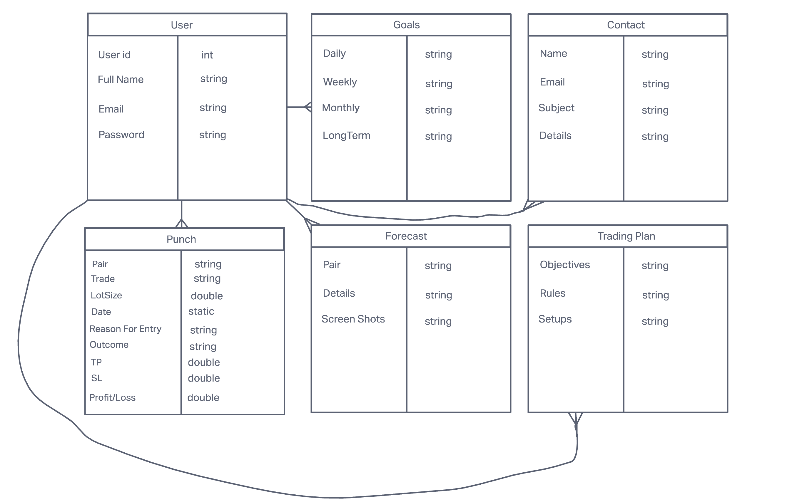
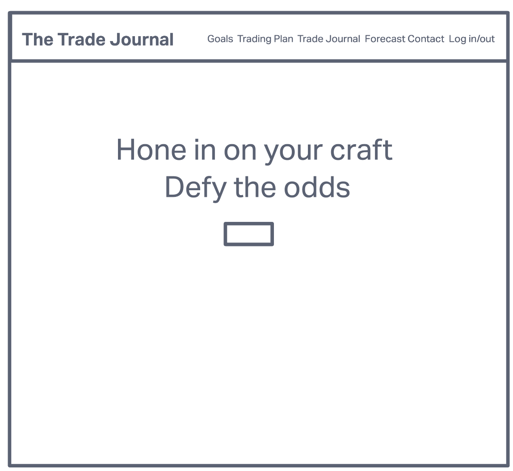
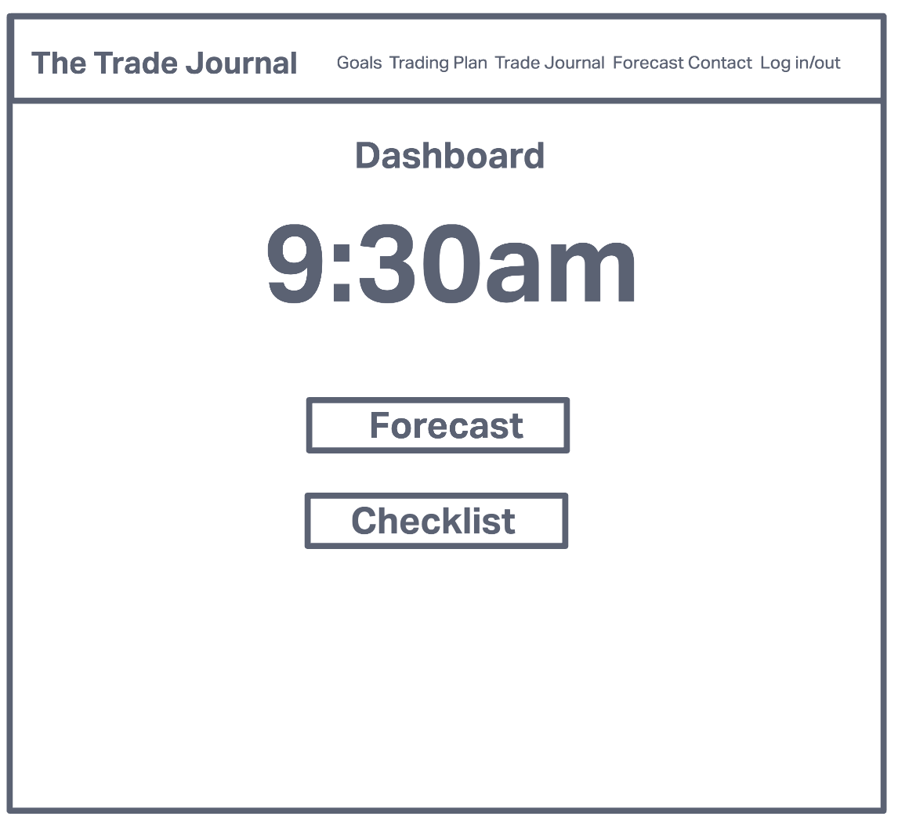
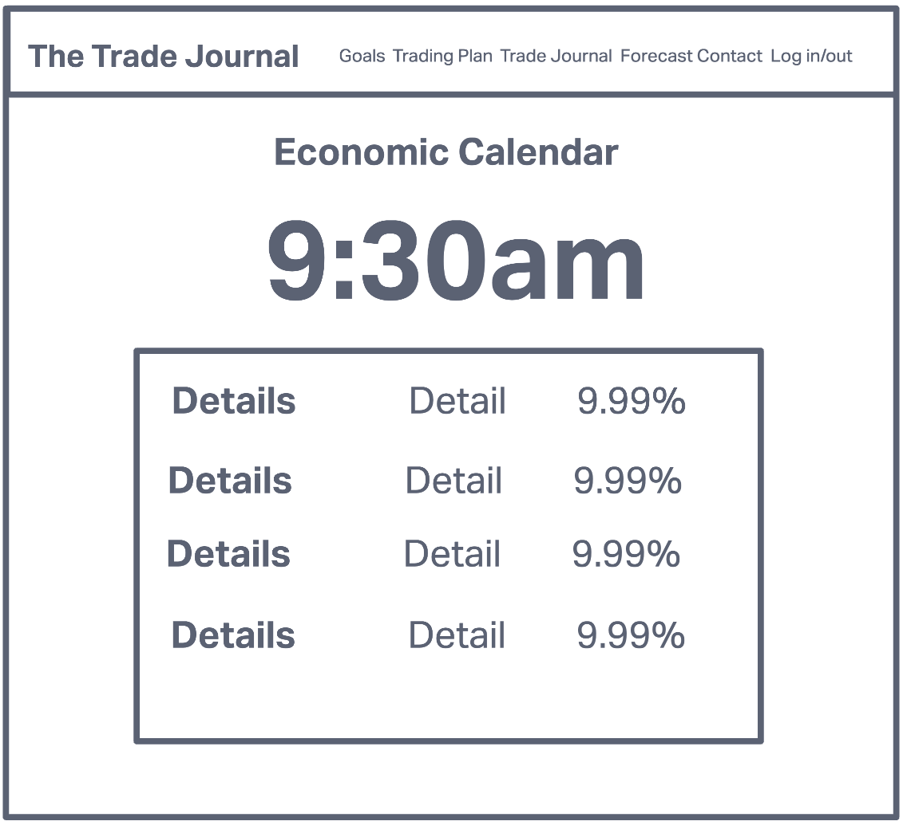
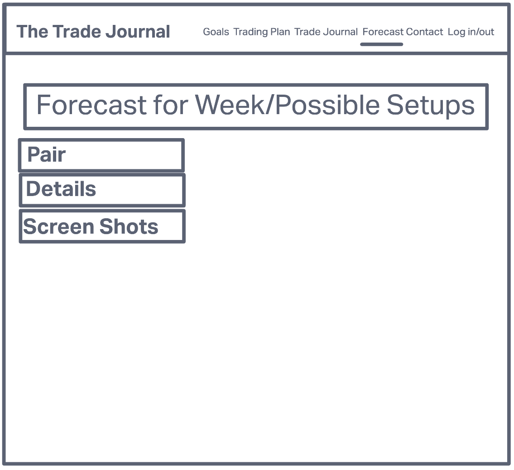
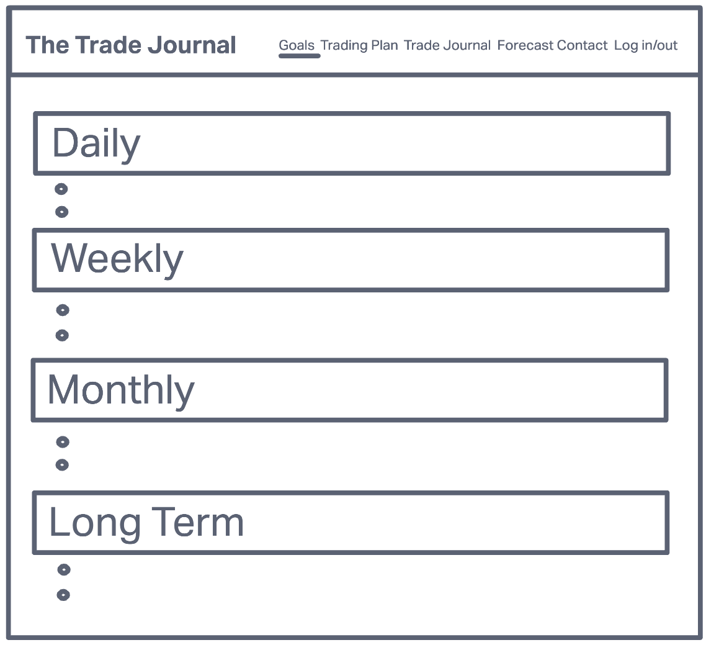
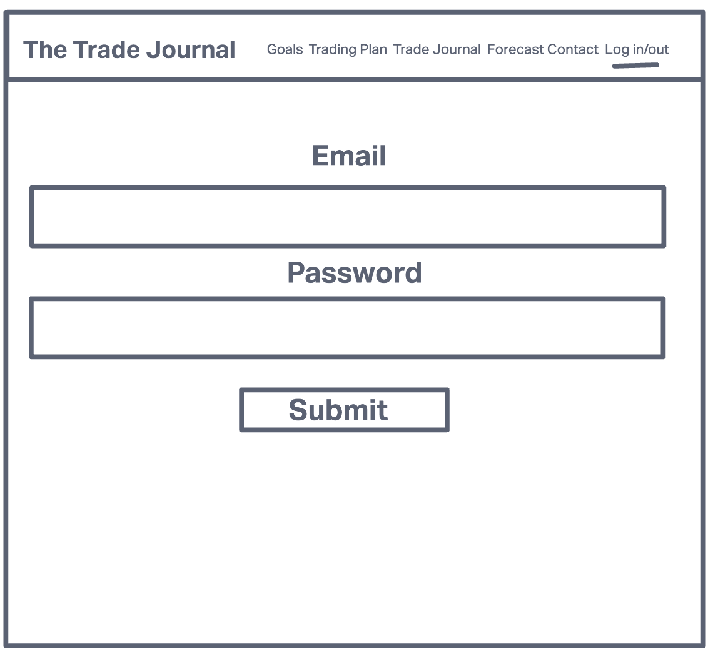
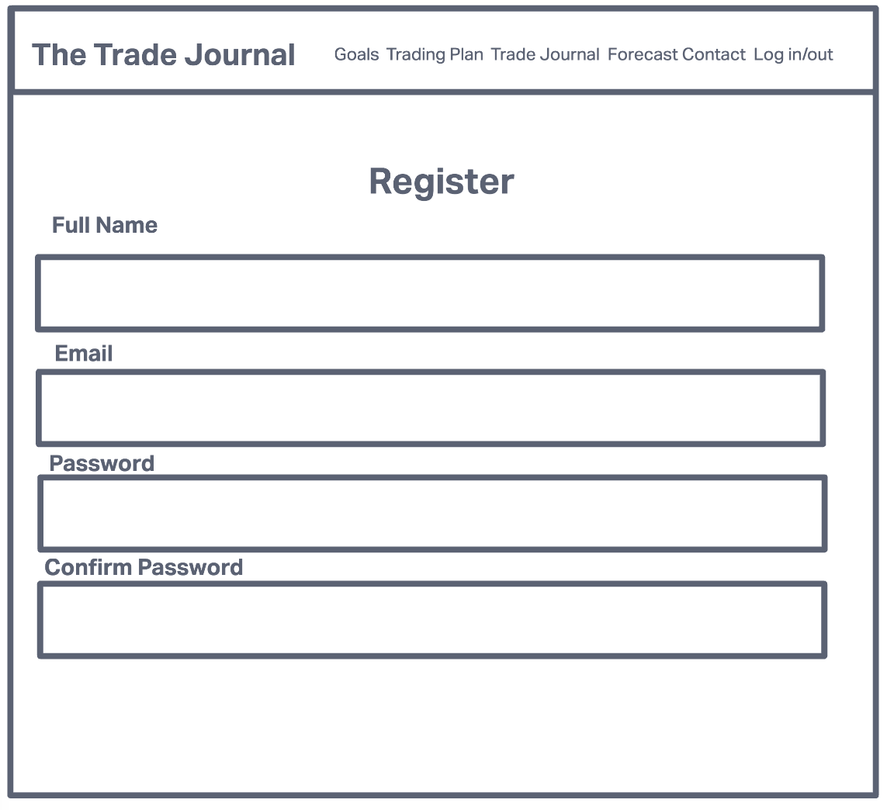
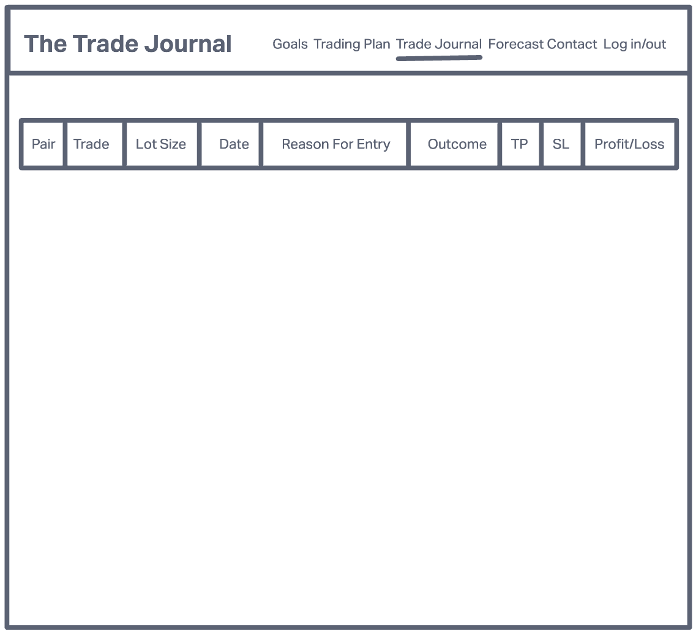
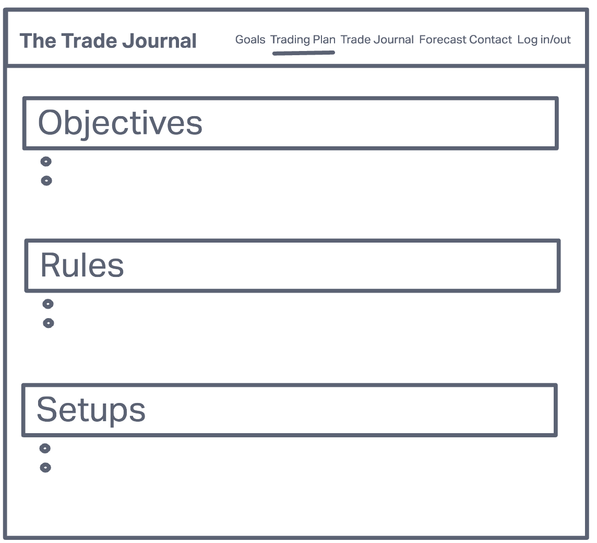

# Trade Journal 📊 📉 📈 💹

#### Web App that will allow clients to log their trade, create action plans and goals. Will also pull api for economic calendar.

###  - By Allen Timothe

## Technologies Used ⚙️ 🛠

* React JS
* Java
* Spring Beans
* Spring Boot
* PostgreSQL
* Google Firebase
* Axios
* React Icons
* Deployed using Heroku

## Live Link ‼️ 🚀 🔥 🎬

## Wire Frames

## Future Updates 🔮

* Add Charts and Trade placement feature.

## Contact 📥 📨
* allen.timothe@gmail.com
